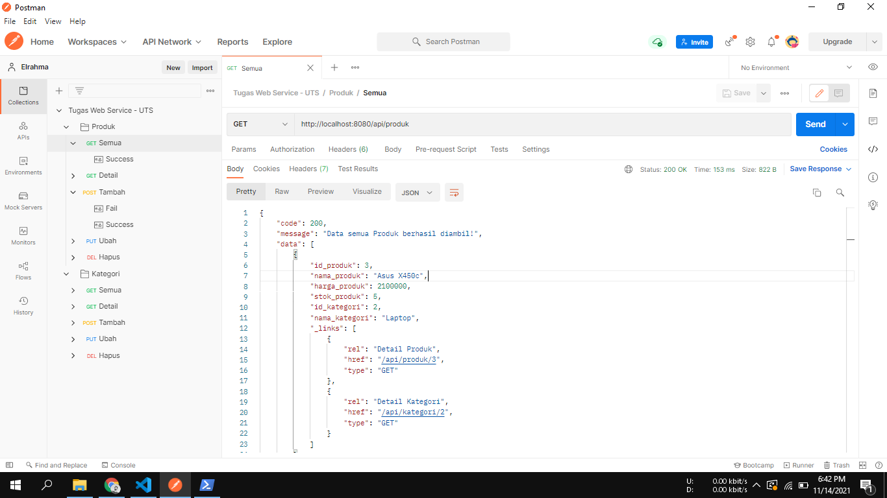

## Tugas-2-Mengimplementasikan-JWT-Caching-dan-Idempotency-pada-REST-API
### Oleh : Tri Hermawan (12191708)

___

### Soal & Ketentuan : 
#### REST API yang sudah anda nilaikan pada UTS minggu lalu, silahkan anda modifikasi dengan menambahkan proteksi JWT, implementasikan juga penggunaan caching dan idempotency.
Demokan dengan membuat video di youtube, dan share juga hasil kode anda menggunakan salah satu berikut ini : github, gitlab, atau bitbucket


### Cuplikan 

___


### Skema Database
#### tb_kategori
```
- id_kategori * Primary, INT, Auto Increment
- nama_kategori VARCHAR
```
#### tb_produk
```
- id_produk * Primary, INT, Auto Increment
- nama_produk VARCHAR
- harga_produk INT
- stok_produk INT
- id_kategori ** Index, INT
```
##### keterangan :
* \* Primary Key
* \*\* Foreign Key
___


### Cara menjalankan?
- Pastikan ```composer``` dan ```local webserver``` (xampp/wampp/dkk) sudah terinstal
- Jalankan ```local webserver```
- Buat database baru dengan ```webservice_uts``` lalu import file ```webservice_uts.sql``` pada database tersebut
- Jalankan command
```
composer install
```
- dan terakhir,
```
php -S localhost:8080 -t public
```
- Maka API sudah bisa dicoba di postman
___


### Download [Postman Collection](https://www.postman.com/collections/bb8eb3d1b778c7a372a2).
